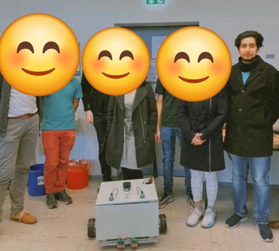
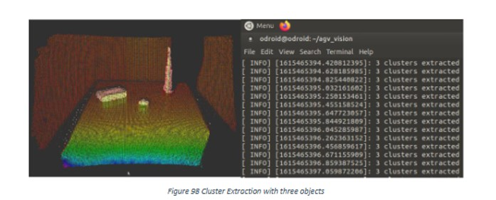
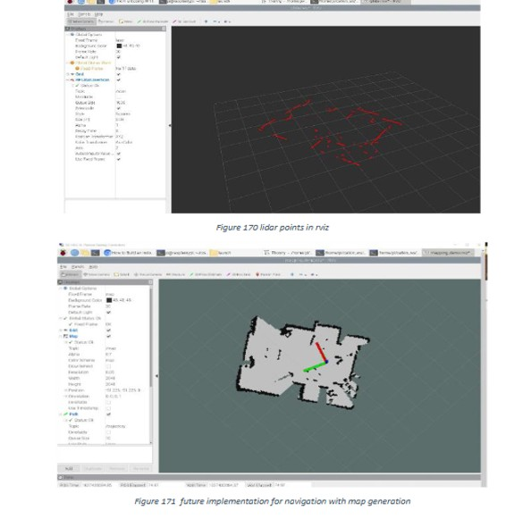
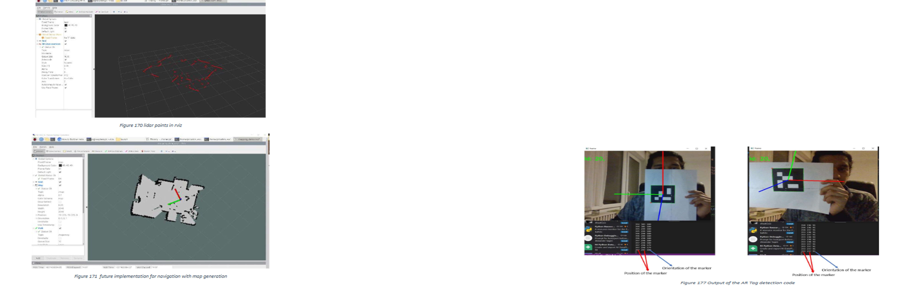

# Autonomous Guided Vehicle (AGV) – Shopfloor Delivery

ROS-based AGV project developed in an Industry 4.0 lab setting to support autonomous shopfloor delivery and station interaction.

---

## My contribution
My main work focused on embedded deployment + perception experiments:

- **ROS2 on Odroid N2**: Set up and tested ROS2-based integration on Odroid N2 as the compute platform.
- **IFM 3D camera – object segmentation**: Tested point-cloud based object segmentation using planar segmentation and Euclidean clustering to extract obstacle clusters.
- **LiDAR SLAM (mapping + localisation)**: Tested SLAM with LiDAR for map generation and localisation experiments.
- **AR markers & RFID tags**: Tested AR markers (e.g., ArUco) and RFID tags as navigation/identification aids for station detection / redundancy.

---

## Results (photos)

<table align="center">
  <tr>
    <td>
      
    </td>
    <td width="12"></td> <!-- small gap -->
    <td>
      
    </td>
  </tr>
</table>

  <em>AGV prototype used for shopfloor delivery experiments (left) and CAD overview (right)</em>

  
   
  <em>IFM 3D camera: point-cloud clustering for object/obstacle segmentation</em>

  
   
  <em>LiDAR SLAM testing: mapping/localisation visualisation in RViz</em>

  
   
  <em>AR marker detection test (marker ID, pose/orientation used as a station cue)</em>

---

## Project files
- `Report/` – detailed report
- `Final_Presentation/` – final slides / presentation
- `Codes/` – implementation and experiments
