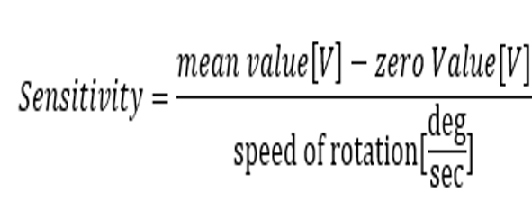
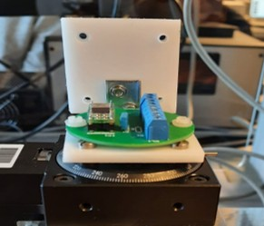
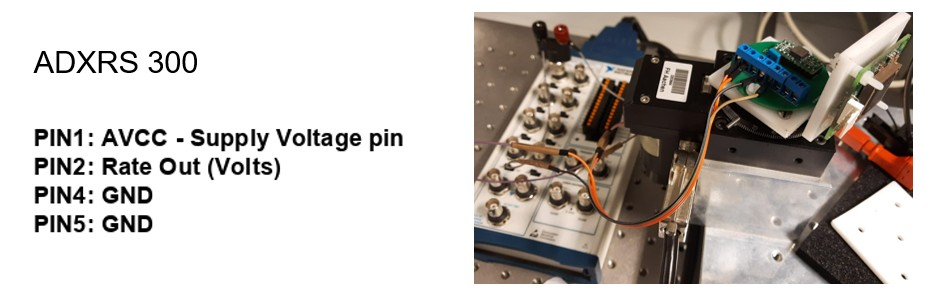
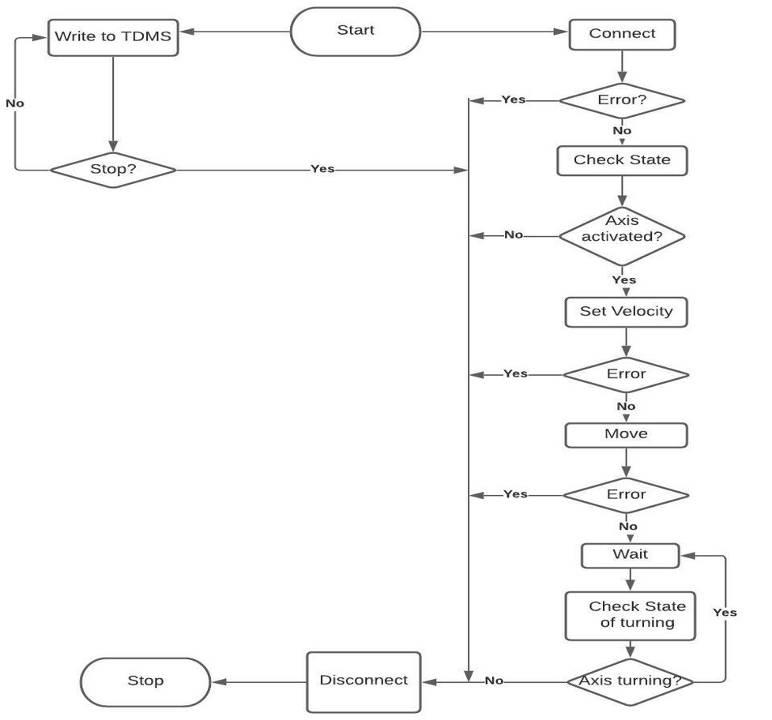
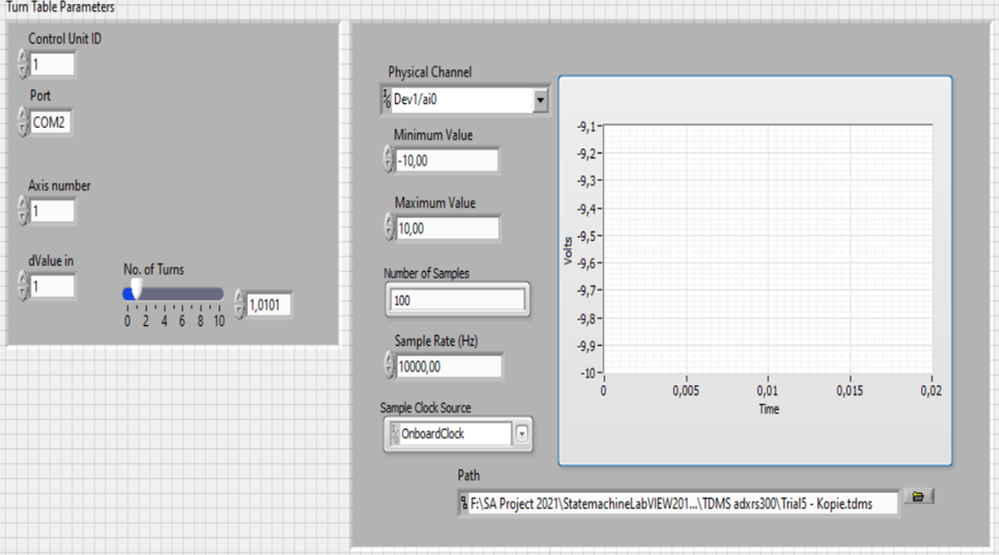
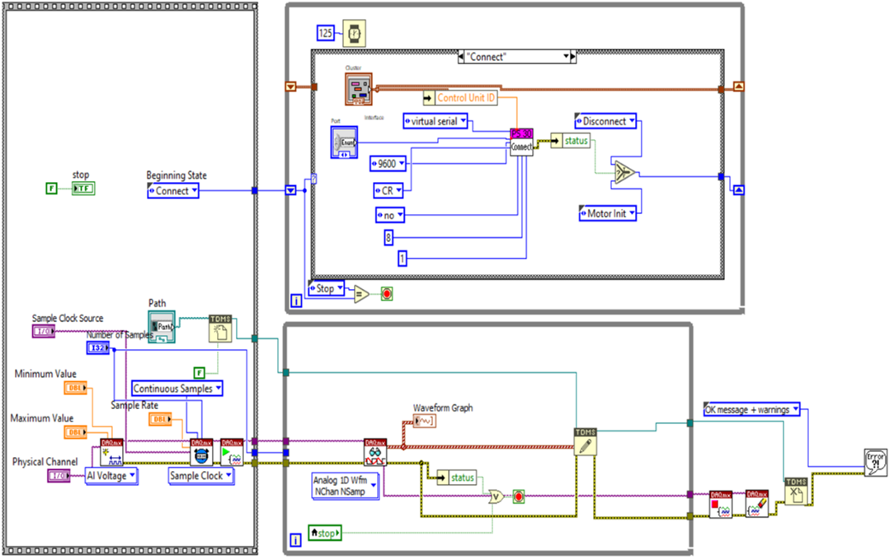
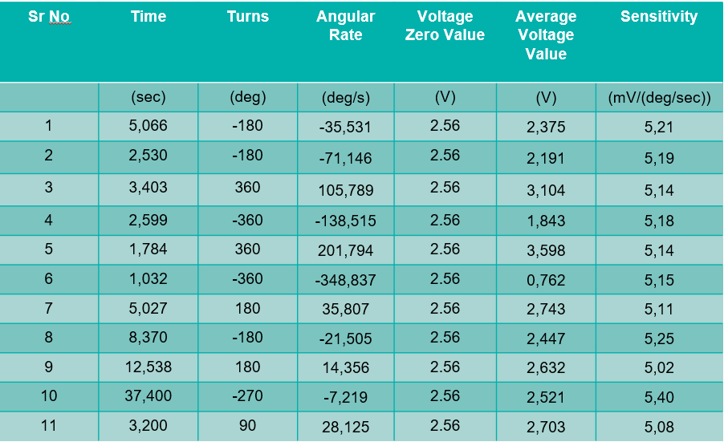
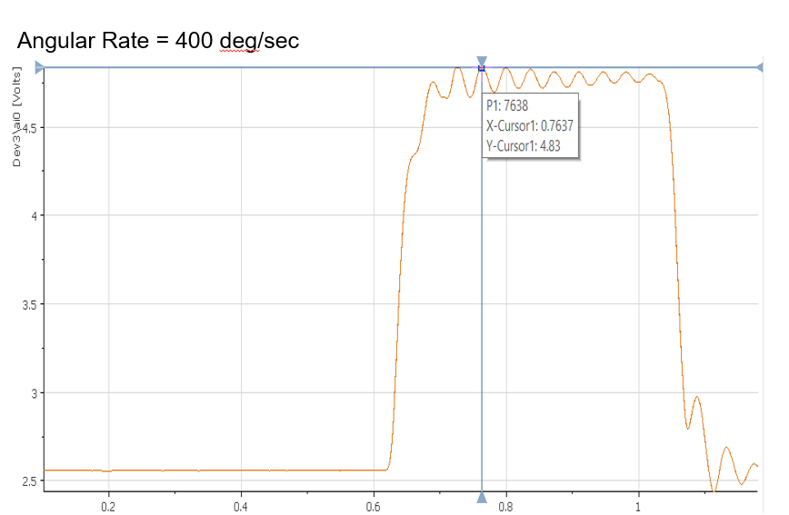
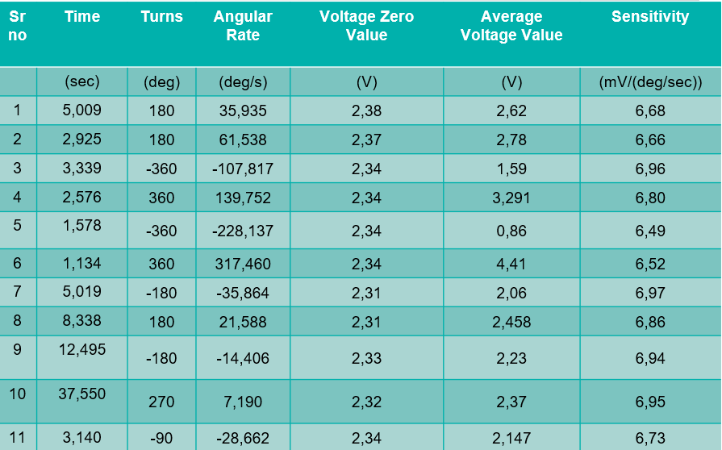
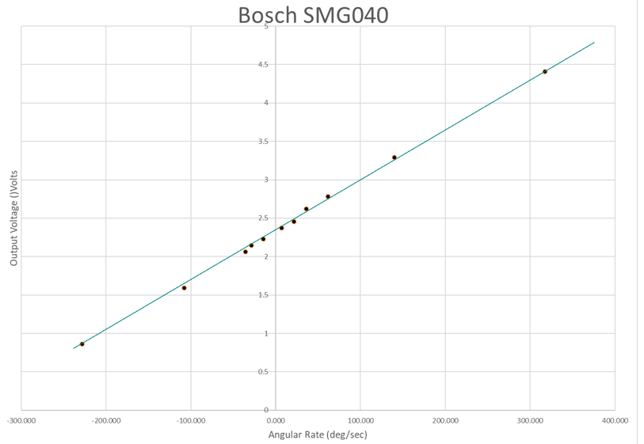

# Angular Rate Sensor Characterisation (LabVIEW) - ADXRS300 and Bosch SMG040

This project characterises two MEMS angular-rate sensors (**Analog Devices ADXRS300** and **Bosch SMG040**) using a turntable-based measurement setup and a LabVIEW-driven measurement workflow.  
The goal is to estimate key sensor parameters (zero-rate output and sensitivity) by measuring output voltage versus angular rate and comparing against expected behaviour. 

---

## Brief introduction
Angular-rate sensors (gyroscopes) measure the rate of rotation of an object with respect to an inertial frame (yaw, pitch, roll) and are used in automotive safety systems such as anti-skid and stability control. 
ADXRS300 measures rotation along the axis normal to the top surface, while SMG040 is a micro-machined gyro intended for rollover-related sensing applications. 

---

## Main characteristic parameters
This characterisation focuses on the parameters listed in the report: **range of operation**, **zero value voltage**, and **sensor sensitivity**. 

### Parameters and definitions
- **Zero-rate output (Zero Value Voltage):** sensor output voltage when angular rate is ~0 deg/s. 
- **Sensitivity:** slope of output voltage vs angular rate (mV/deg/s). 
- **Maximum usable rate / saturation:** the angular rate beyond which the output no longer behaves linearly (sensor saturates). 

---

## Formula used
During measurement, the turntable motion is converted to angular rate and compared against sensor output voltage to estimate sensitivity. 

  
   
  <em>Formula used for angular rate and sensitivity calculation</em>

---

## Measurement setup 
The measurement setup mounts the sensors on a turntable and reads the sensor output voltage while the turntable is rotated at defined speeds/turn counts. [file:614]  
ADXRS300 is mounted with spacers to isolate sensor terminals; SMG040 is mounted vertically because its sensitive axis is horizontal to the chip. [file:614]

### ADXRS300 setup photo

  
   
  <em>ADXRS300 mounting and wiring on the turntable setup</em>

### ADXRS300 setup photo

  
   
  <em>ADXRS300 wiring on the turntable setup</em>

### Bosch SMG040 setup photo

  
   
  <em>Bosch SMG040 mounting orientation on the turntable setup</em>

---

## Measurement strategy
The measurement strategy follows the workflow described in the report: rotate the turntable via LabVIEW by a specified number of turns and speed, read out the sensor voltage, compute angular velocity of the turntable, and compute sensitivity. [file:614]

Add the short version of the steps:

- Rotate the turntable using LabVIEW (set speed / number of turns). [file:614]
- Measure sensor output voltage during motion. [file:614]
- Compute angular rate of the turntable from the motion command/turns. [file:614]
- Compute sensitivity from the relation between output voltage and angular rate. [file:614]

(Optional) Add any notes you want here about repeatability, averaging, or filtering.

---

## State flow diagram (you will add)

  
   
  <em>LabVIEW state flow diagram for the measurement sequence</em>

---

## UI / Front panel (you will add)

  
   
  <em>LabVIEW front panel used to control the turntable and log sensor readings</em>

---

## VI block diagram (you will add)

  
   
  <em>LabVIEW VI block diagram (signal flow and computation blocks)</em>

---

## Results

### ADXRS300 — key results
From the report results:
- **Average sensitivity:** 5.17 mV/deg/s (observed). [file:614]
- **Specified sensitivity range:** 4.6–5.4 mV/deg/s. [file:614]
- **Zero value voltage:** 2.56 V. [file:614]
- **Saturation noted around:** ~400 deg/s (shown as saturation behaviour). [file:614]

  
   
  <em>ADXRS300 measurement table (time, turns, rate, voltage, sensitivity)</em>

  
   
  <em>ADXRS300: output voltage vs angular rate</em>

  
   
  <em>ADXRS300: saturation behaviour at high angular rate</em>

---

### Bosch SMG040 — key results
From the report results:
- **Average sensitivity:** 6.78 mV/deg/s (observed). [file:614]
- **Specified sensitivity range:** 6.50–7.50 mV/deg/s. [file:614]
- **Zero value voltage:** 2.34 V. [file:614]
- **Saturation noted around:** ~350 deg/s (shown as saturation behaviour). [file:614]

  
   
  <em>Bosch SMG040 measurement table (time, turns, rate, voltage, sensitivity)</em>

  
   
  <em>Bosch SMG040: output voltage vs angular rate</em>

  
   
  <em>Bosch SMG040: saturation behaviour at high angular rate</em>

---

## Comparison summary (from conclusion)
| Property | ADXRS300 | Bosch SMG040 |
|---|---:|---:|
| Maximum rate (deg/s) | 350 | 300 |
| Sensitivity (mV/deg/s) | 5.17 | 6.78 |
| Zero value voltage (V) | 2.56 | 2.34 |

These values are taken from the report conclusion table. [file:614]

---

## Conclusion
Both sensors show sensitivities within the specified ranges reported in the document, and saturation behaviour is visible at high angular rates (ADXRS300 around ~400 deg/s; SMG040 around ~350 deg/s). [file:614]  
Overall, the setup and LabVIEW workflow are sufficient to estimate zero-rate output and sensitivity from voltage vs angular-rate measurements. [file:614]

---

## Files
- `characterisation_pdf.pdf` — original report/reference document
- `Images/` — measurement setup photos, UI screenshots, block diagrams, and plots
