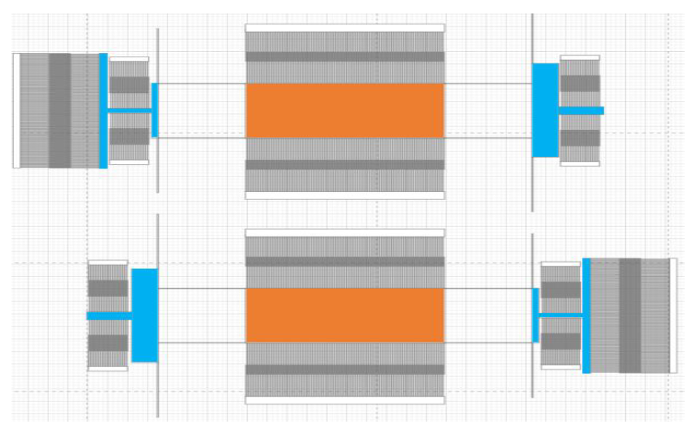
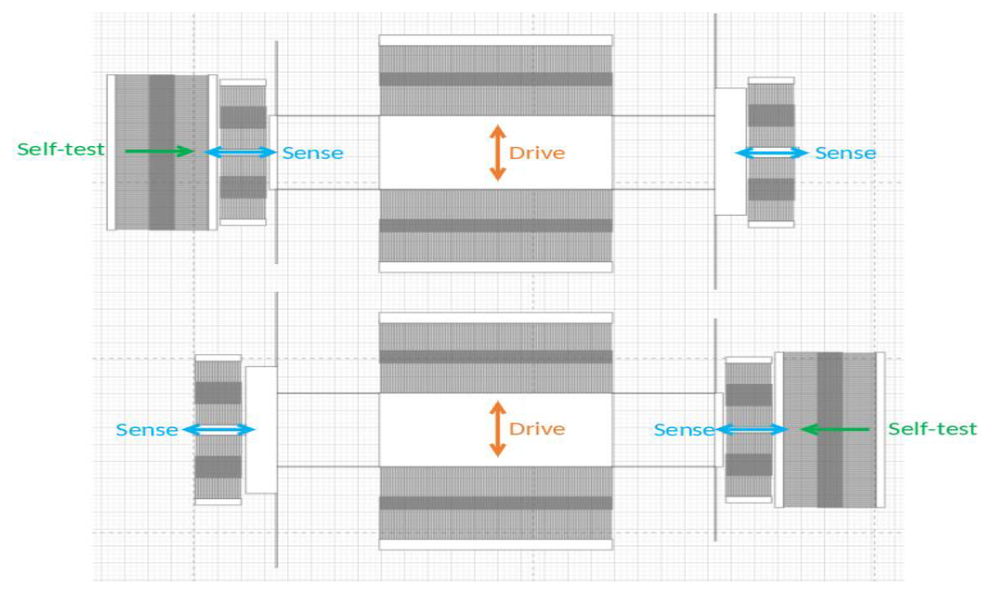
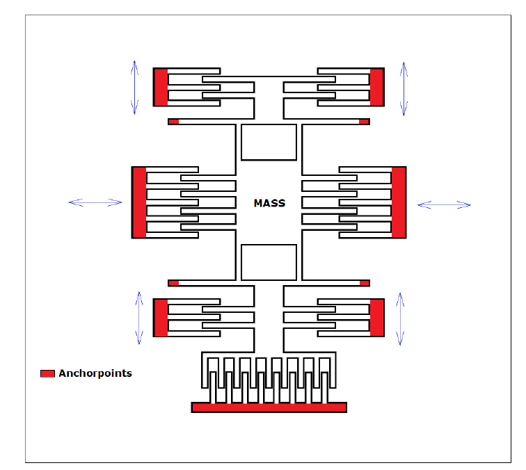
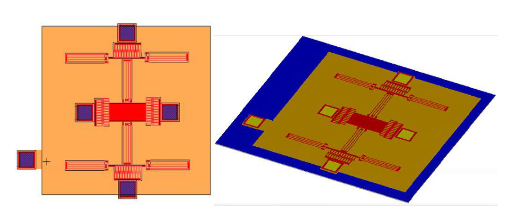
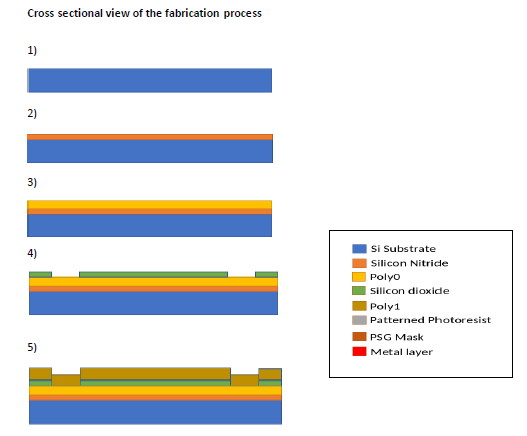
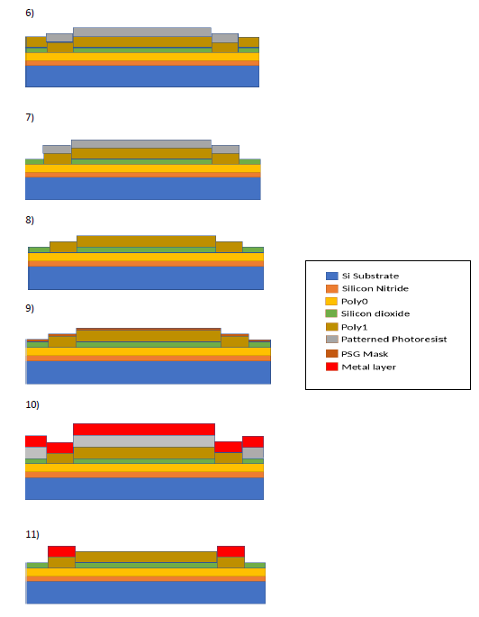
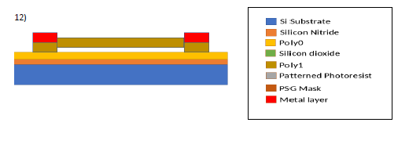
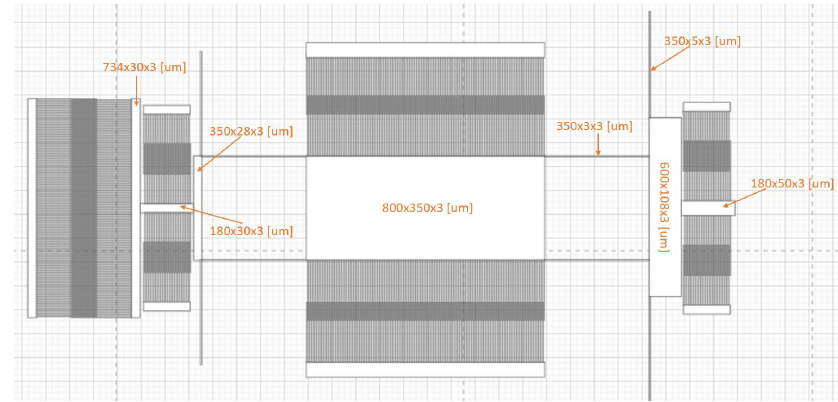

# MEMS Angular Rate Sensor - Concept Design (Coriolis-based, PolyMUMPs)

Conceptual design project for a surface-micromachined angular rate sensor (spring–mass + comb structures) based on the Coriolis effect, including a proposed PolyMUMPs fabrication process and dimensioning calculations.

## Requirements (given)
- Bandwidth: DC up to 100 Hz
- Measuring range: 600°/s
- Resolution: 0.1°/s
- Integrated self-test structure generating a signal equivalent to 100°/s

---

## Brief introduction
Angular rate sensors measure rotational speed relative to an inertial reference frame (roll, pitch, yaw) and are widely used in stabilization and safety systems such as automotive ESP and navigation.  
This project focuses on a MEMS, spring–mass based gyroscope concept where a driven vibration mode couples into a sense mode under Coriolis acceleration.

---

## Design concept (Coriolis spring–mass)
The selected design uses two proof-mass structures with comb-like electrodes and spring suspension, fabricated via surface micromachining.  
Two structures are driven in opposite oscillation so that linear acceleration effects can be rejected and rotation can be extracted via differential behaviour.

### Figures (Design)

  
   
  <em> Proof-mass/comb structure arrangement (design view)</em>

  
   
  <em> Drive/sense/self-test directions in the two-structure layout</em>

  
   
  <em> Single structure sketch (springs, proof mass, combs, self-test comb drive)</em>

**Self-test idea:** A dedicated comb drive deflects the proof mass to generate a known reference response corresponding to an equivalent 100°/s input rate.

---

## Fabrication process (PolyMUMPs)
The proposed fabrication uses the PolyMUMPs three-layer polysilicon surface micromachining flow.  
Key material roles: crystalline silicon substrate; silicon nitride insulation; polysilicon structural layers; silicon dioxide sacrificial layer; metal for contacts.

### Figure (3D design)

  
   
  <em> 3D design using L-Edit</em>

### Fabrication steps (summary)
1. Deposit crystalline silicon substrate (~600 µm).
2. Deposit silicon nitride insulation layer (LPCVD).
3. Deposit doped Poly0 to ground stray charges.
4. Deposit sacrificial silicon dioxide with anchor holes to connect Poly1 to Poly0.
5. Deposit Poly1 (static + moving structures), anchored to Poly0.
6. Pattern photoresist where Poly1 must remain intact.
7. Etch Poly1 (poly etched, oxide preserved).
8. Remove photoresist.
9. Deposit PSG mask for doping / stress reduction, then remove PSG.
10. Pattern photoresist + deposit metal layer for contacts.
11. Lift-off to form the final metal contacts.
12. Release by etching remaining oxide (HF) to free the structure.

### Cross-sectional process view

  
   
  <em>Cross-sectional view of the PolyMUMPs process steps (1–5)</em>

  
   
  <em>Cross-sectional view of the PolyMUMPs process steps (6-11)</em>

  
   
  <em>Cross-sectional view of the PolyMUMPs process steps (12)</em>

---

## Dimensions & key parameters
Main dimensions are defined in the report and illustrated in Fig. 6.1.

  
   
  <em>  Main dimensions of the angular rate sensor</em>

### Additional geometry (used in calculations)
**Sense capacitors:** No. of Fingers Ns = 40, Length lsc = 200 µm, Gap Gs = 2 µm, Height hsc = 3 µm.  
**Comb drive actuator:** No. of Fingers Nd = 200, Length lcd = 200 µm, Gap Gd = 2 µm, Height hcd = 3 µm.  
**Electrical values of sensor:** DC Voltage, VDC = 15 V, AC Voltage, VAC = 1.5 V.

---

## Calculations (results)
Calculations were implemented in MATLAB to enable quick parameter sweeps and optimisation by trial-and-error.

### Constants / assumptions
- ρ = 2300 kg/m³
- Youngs Modulus ε0 = 8.854 × 10⁻¹² C/(V·m)
- E = 160 GPa
- Qd = 300, Qs = 300

### Key computed values (from report)
- Drive mass: md = 1.9322 × 10⁻⁹ kg
- Sense mass: ms = 2.6364 × 10⁻⁹ kg
- Drive inertia: Md = 8.1 × 10⁻²³ kg·m²
- Sense inertia: Ms = 3.75 × 10⁻²² kg·m²
- Spring constants: kd = 0.9068 N/m, ks = 4.1983 N/m
- Resonance frequencies: fd = 3.4 × 10⁴ Hz, fs = 6.27 × 10⁴ Hz
- Angular frequencies: ωd = 2.14 × 10⁵ rad/s, ωs = 3.94 × 10⁵ rad/s
- Resolution target (converted): 0.1°/s → Ωrad = 0.0017 rad/s
- Comb-drive force (2 comb drives): Fd = 1.2 × 10⁻⁷ N
- Drive amplitude at resonance: xd = 4.06 × 10⁻⁷ m
- Sense amplitude (magnitude): xs ≈ 2.77 × 10⁻¹⁵ m
- Phase angle: ϕ ≈ 89.85°
- Operating point: x0 = 7.12 × 10⁻¹⁴ m
- First harmonic force at operating point: Fs,AC = 5.98 × 10⁻⁷ N
- Sense current amplitude: is = 4.72 × 10⁻¹⁶ A

### Self-test sizing (100°/s equivalent)
- Coriolis force at 100°/s: Fc = 2.436 × 10⁻⁸ N
- Example actuator sizing to match Fc: N ≈ 92 comb fingers, V ≈ 8 V.

**Note:** The full sensor contains two mirrored structures; total size/mass is effectively doubled compared to the single-structure calculations.

---

## Difficulties / limitations
- Results are theoretical and not validated experimentally; real behaviour may differ.
- Simulation/validation could not be completed due to software issues (S-Edit), so calculations remained the main verification method.
- Measuring range was conceptually targeted but difficult to compute rigorously within the project scope.
- Overall sensor size is about ~1 mm; further optimisation (e.g., reducing mass via spring redesign) could reduce footprint.

---

## Conclusion
A Coriolis-based spring–mass concept with differential sensing was developed and dimensioned against the given requirements, and a PolyMUMPs fabrication process flow was defined.  
Although simulation validation could not be carried out, the design shows potential to meet the task requirements and provides a clear basis for future simulation and prototyping.

---

## Project report
- `Report_MMS_Design-of-angular-rate-sensors.pdf` (Project report)
- `Images` (Images used in the readme)
