# THE MOW-HAWK - Low-cost autonomous lawn mower prototype

A low-cost autonomous lawn mower prototype built for learning **Systems Engineering** and **embedded systems** using Arduino + ESP32, including boundary detection, obstacle avoidance, battery monitoring, and a browser-based web interface.

> Note: This is an academic prototype; blades/charging station are treated as simulated/hypothetical in the scope of the project.

---

## 1) Project (Requirement specification)

### 1.1 Goal
Build and deliver a functioning prototype based on a low-cost robot platform using **Arduino Uno R3** and **NodeMCU ESP32** for Wi‑Fi connectivity and mobile-phone control.

### 1.2 Constraints (assumptions/environment)
- Base platform: “Smart Robot Car Assembly DIY Kit set” (~20€) + limited additional budget.
- Controlled environment: dry, flat surface; slope < 10°; good Wi‑Fi coverage; not designed for wet/heat/cold resistance.
- Boundary is defined using black tape; charging station is considered fictional/simulated and charging is manual after docking.

  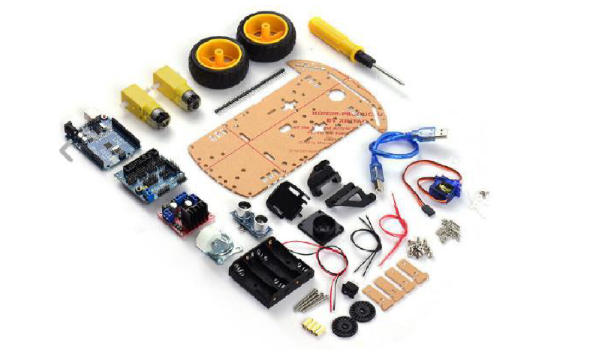
   
  <em>Base platform: Smart Robot Car Assembly DIY Kit set</em>

### 1.3 Hardware & architecture (high level)
- Arduino Uno R3 + sensor shield; NodeMCU ESP32 for Wi‑Fi/web interface.
- Motors driven via L298N.
- Perception: IR sensors for boundary/edge/line following; ultrasonic sensor on a servo for obstacle detection.
- Battery monitoring: INA219 sensor; low-battery triggers return-to-base via line following.

  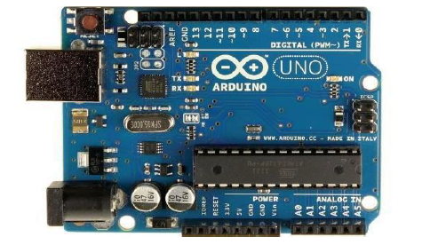
  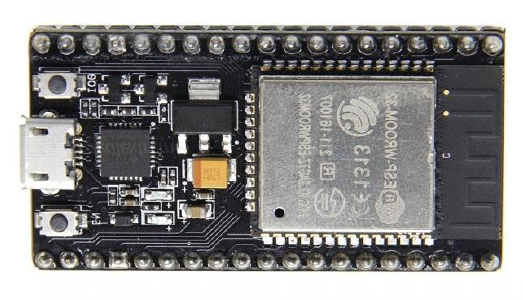
   
  <em>Arduino Uno &  ESP 32  hardware</em>

### 1.4 Functional requirements (implemented behaviour)
- Autonomous navigation within boundary using IR sensors; obstacle detection/avoidance using ultrasonic + servo.
- Low-battery detection via INA219; return to charging station using boundary/line following; stop at base (manual charging).
- Manual mode via web app for recovery/operation when sensors fail.
- Emergency stop and power on/off via web app; basic on-board switch for power control.

### 1.5 Non-functional requirements (selected)
- Usable by laypersons (simple web UI), clean wiring/layout, and quick response for boundary/obstacle handling.
- Target coverage: 3 m × 3 m area on a single charge (prototype requirement).
- Access control: web UI requires Wi‑Fi credentials/login.

### 1.6 System engineering artifacts (from the spec)

  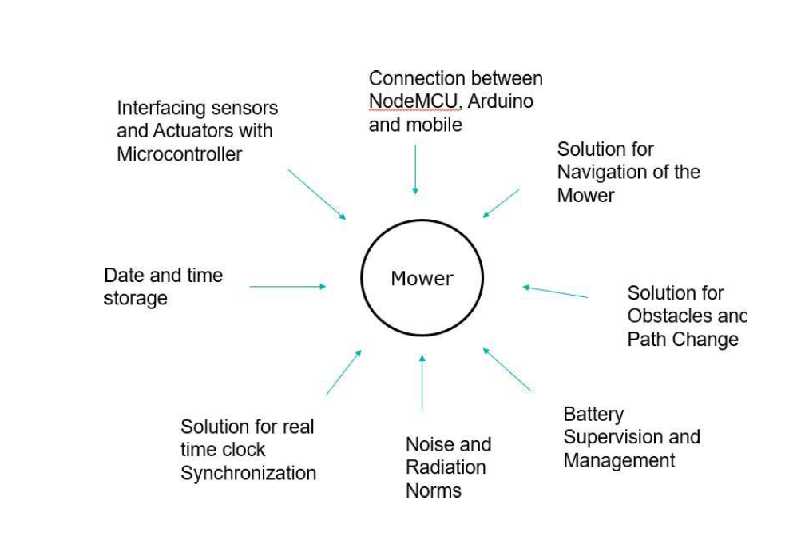
   
  <em>Work context diagram</em>

  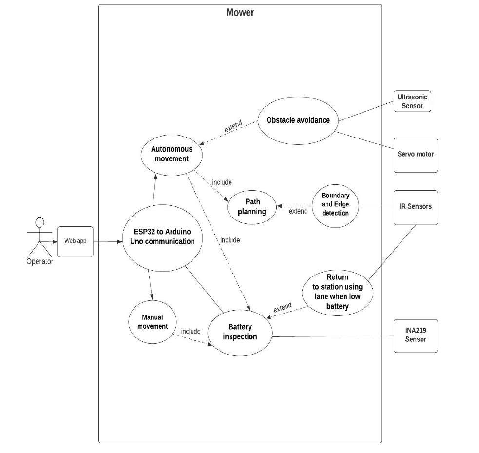
   
  <em>Use case diagram</em>

  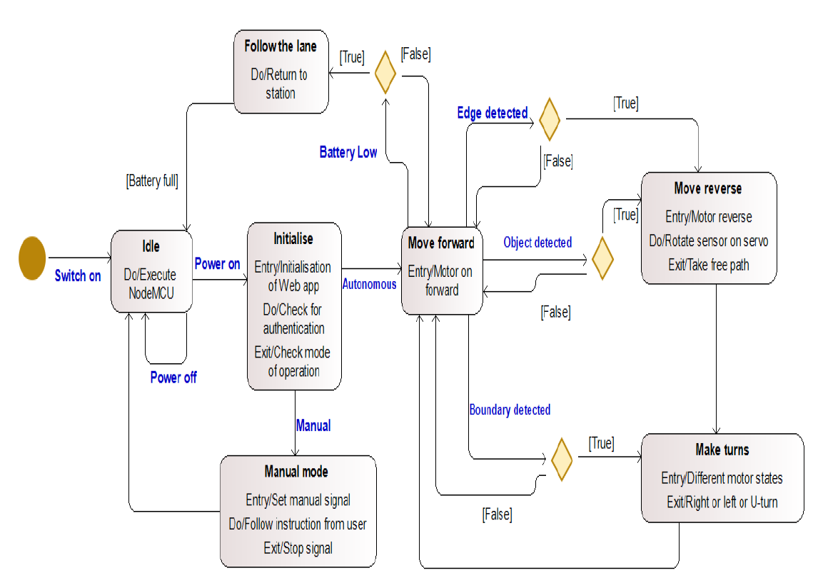
   
  <em>State machine diagram</em>

  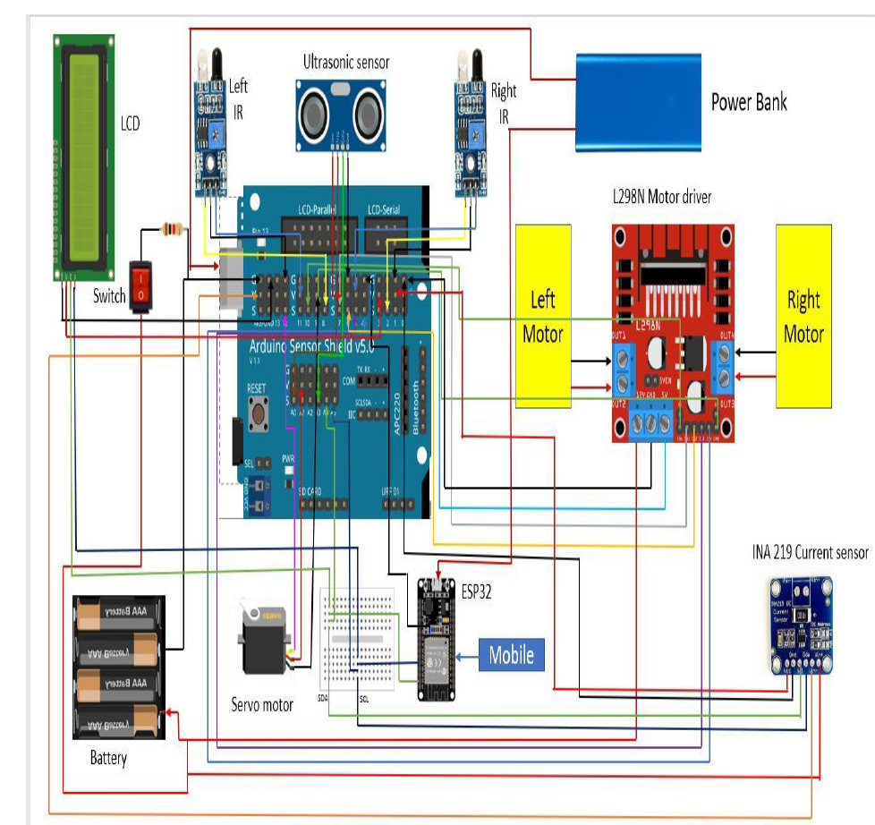
   
  <em>Parametric diagram</em>

### 1.7 Risks (summary)
Main risks include sensor/microcontroller malfunction leading to boundary loss or obstacle collision; recommended mitigation includes calibration and securing electrical connections.

  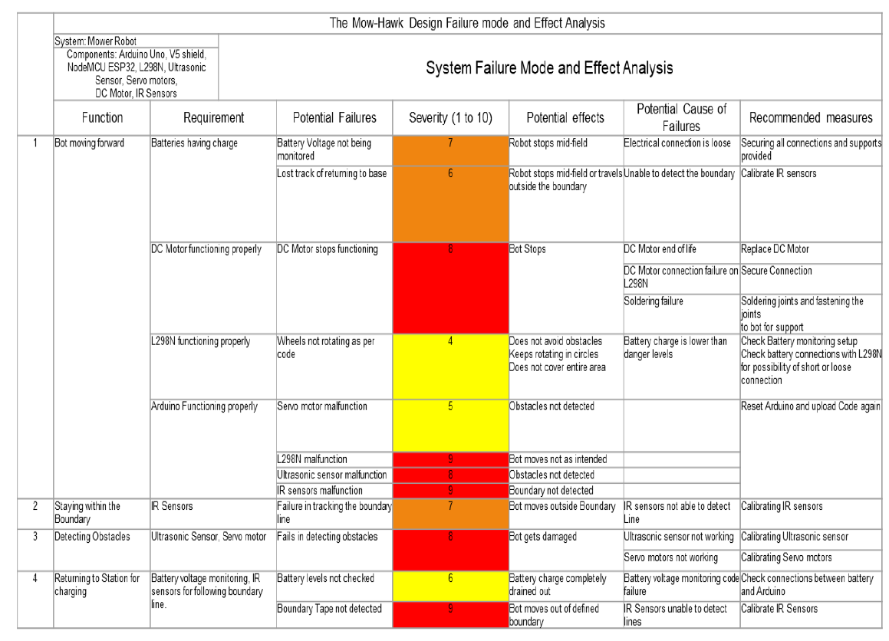
   
  <em>Design Failure mode and Effect analysis (DFMEA)</em>

---

## 2) User manual (How to operate)
> This section is a README-friendly version of the project’s user manual. For full details, see `user manual.pdf`
### 2.1 Safety (high priority)
- Keep away from children; do not operate unattended near people/pets; do not use in wet conditions; power off/remove battery before inspection/cleaning.
- Do not pick up/carry while running; do not modify the design; keep screws/nuts/wires intact.

### 2.2 Getting to know your bot
The Mow‑Hawk supports:
- **Autonomous mode:** runs on a defined path, stops/draws back/turns when it detects obstacles, and returns to the charging base when needed.  
- **Manual mode:** user controls navigation via the web interface buttons.  
- **Auto return on low battery:** when battery is low, it stops mowing and follows the boundary back to the charging base; after charging it resumes mowing or stays parked according to schedule.

  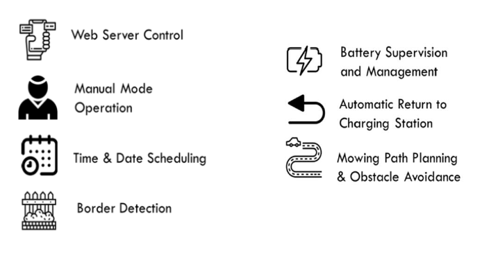
   
  <em> Overview of lawn mower </em>

### 2.3 Mechanical parts (what’s inside)
Main components:
- Robot chassis  
- Wheels and mechanical joints  
- DC motors and motor driver  
- Arduino UNO + sensor shield  
- NodeMCU (Wi‑Fi control)  
- Battery (plus power bank, if used in your build)  
- IR sensors (boundary/edge/line following)  
- INA219 sensor (battery monitoring)

  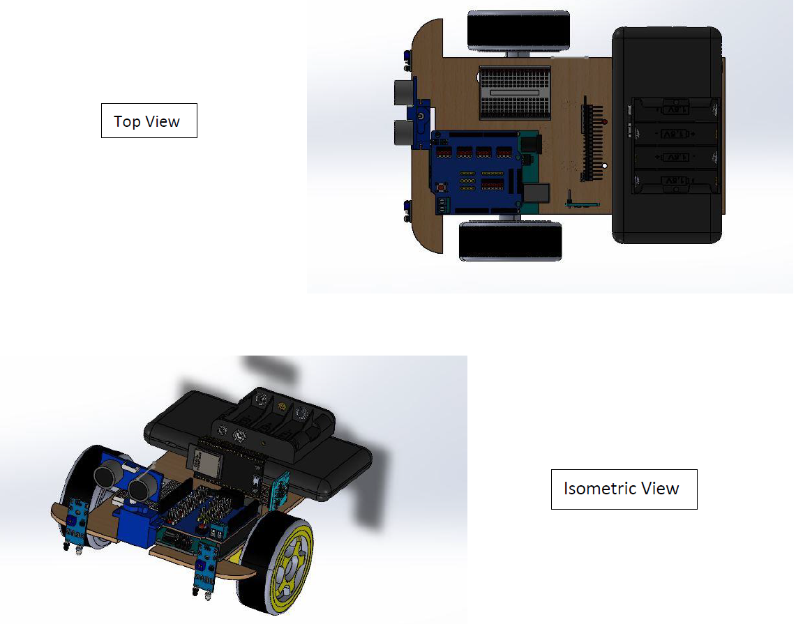
   
  <em> Mechanical design </em>

### 2.4 Setup (quickstart)
1. Prepare a clean operating area and apply boundary tape (perimeter + forbidden zones if needed).
2. Place the charging station on flat ground with a straight entry/exit path (prototype uses manual charging after docking).
3. Power on the mower.
4. Connect to Wi‑Fi and open the web UI:
   - Connect to mower Wi‑Fi (SSID shown in manual).
   - Open `192.168.4.1` in a browser.
   - Login (default example in manual: Username `Mowhawk`, Password `pwd123`).

  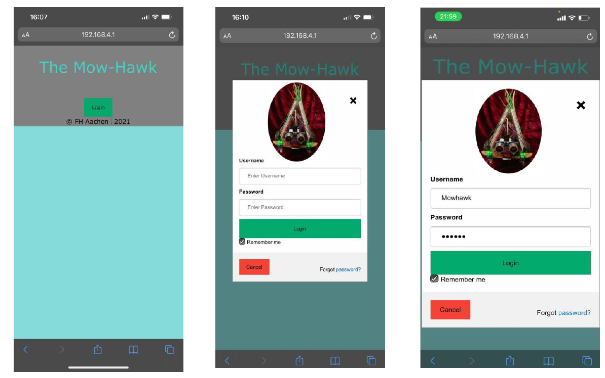
   
  <em>Web UI login page</em>

### 2.5 Modes of operation
- Manual mode: drive the mower using directional buttons.
- Autonomous mode: mower runs on its own based on schedule/time and internal state logic.

<table align="center">
  <tr>
    <td>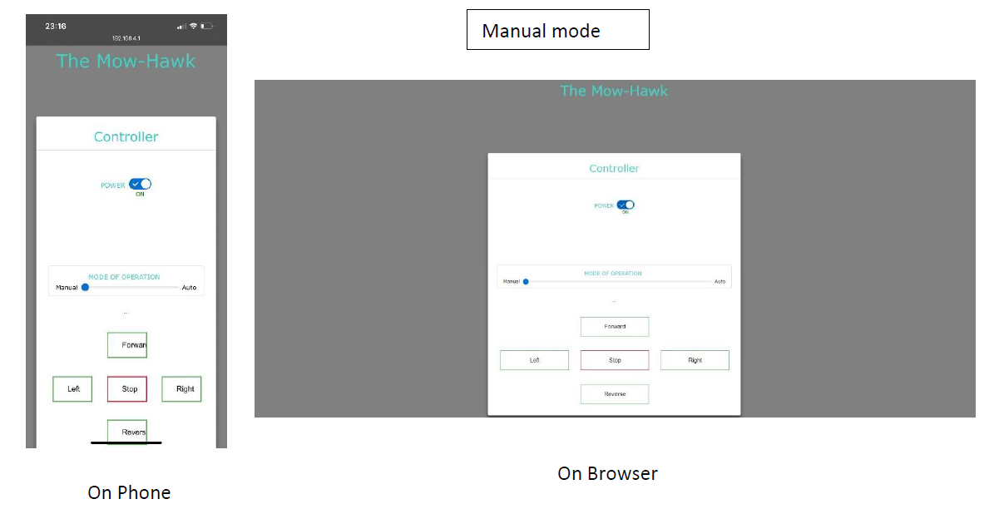</td>
    <td width="12"></td>
    <td>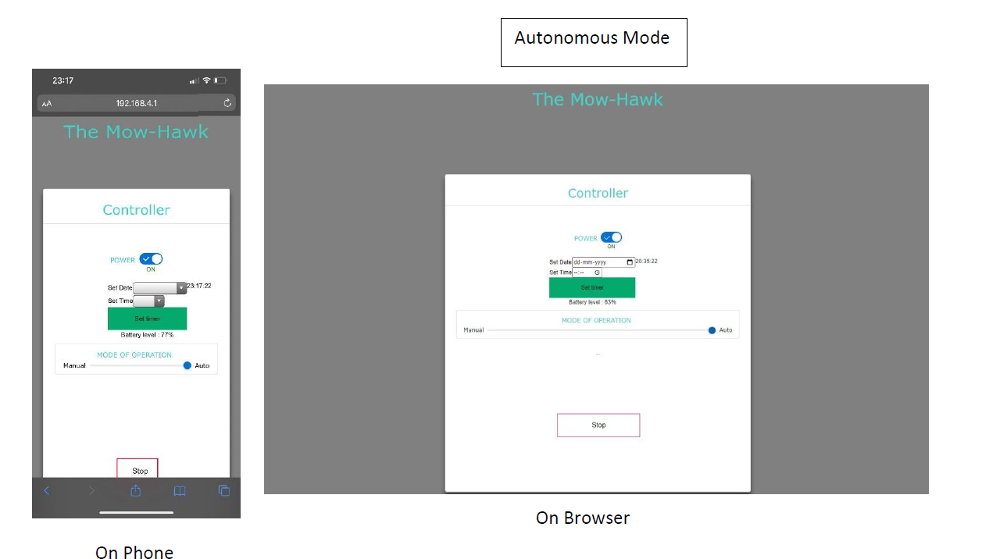</td>
  </tr>
</table>

<em>Manual mode (left) and autonomous mode (right)</em>

### 2.6 Scheduling
Autonomous mode allows selecting a date/time and setting a timer; the UI also provides a stop button.

  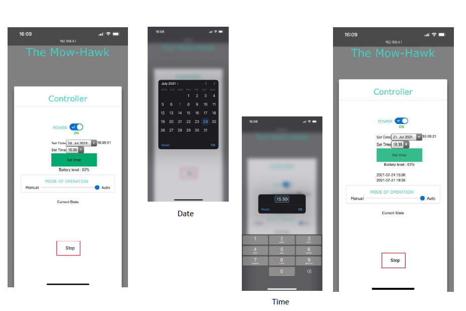
   
  <em>Scheduling and time log UI</em>

### 2.7 On-board HMI
The mower includes a 16×2 LCD for showing the current process / messages and an emergency stop button to cut power in emergencies.

  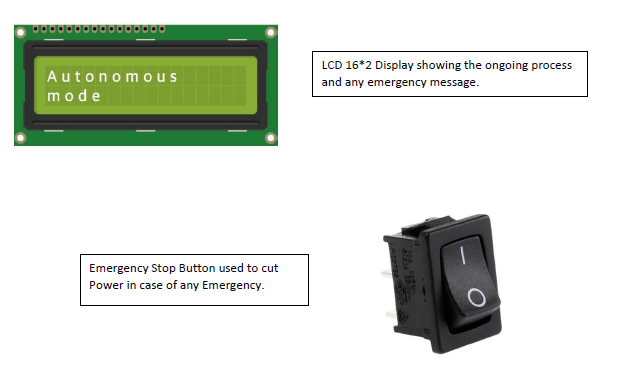
   
  <em>On-board HMI: LCD and emergency stop</em>

### 2.8 Maintenance & troubleshooting
Weekly checks: keep it clean (no running water), verify tight fasteners, inspect wires/sensors, keep battery charged and stored properly.  
Troubleshooting includes clock/scheduling corrections, removing debris from underside, checking Wi‑Fi/NodeMCU connections, and replacing old batteries.

### 2.9 Technical specifications (prototype)
- Physical dimensions: 160 mm × 250 mm × 160 mm
- Weight (without battery): 718 g
- Battery: 7500 mAh, max output ~10 W

---

## 3) Project presentation (What was achieved)

### 3.1 What works (demo features)
Completed features include: pre-defined arena coverage, obstacle avoidance, boundary/edge detection, low-battery return via line-following, and a web interface for manual/autonomous control with emergency stop and battery indicator.

  
     
  <em>Mowhawk in action</em>

For the full video, check the mp4 file.

### 3.2 Components (as used)
Arduino Uno, V5 shield, ESP32, L298N motor driver, IR sensors, ultrasonic sensor, DC motors, batteries + power bank, wheels/base/cover.

  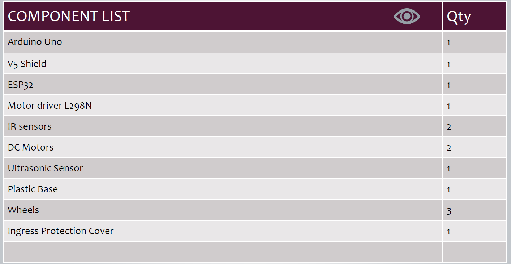
   

  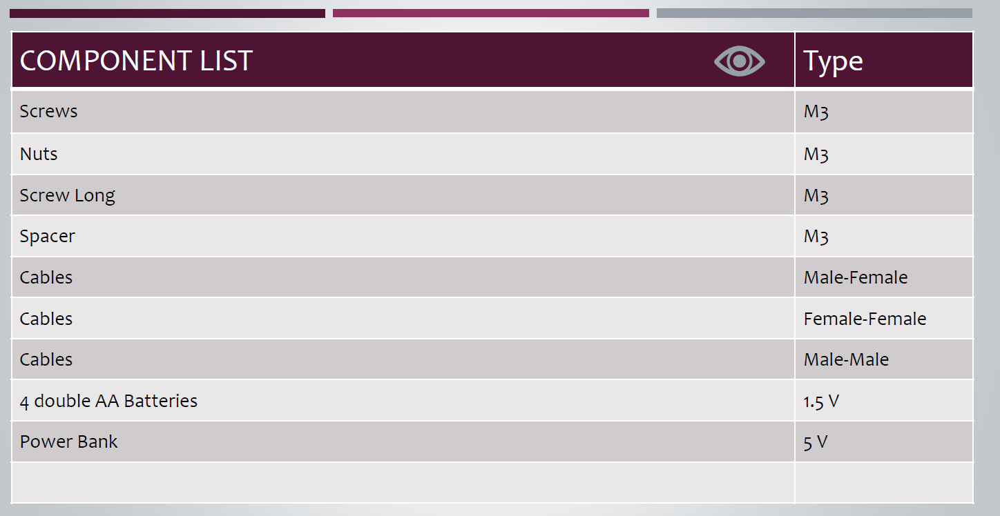
     
  <em>Component list used in the prototype</em>

---

## Documents
- Requirements specification: `Requirement-specification-document-Aadithya-and-Vedha.pdf`
- User manual: `user-manual.pdf`
- Project presentation: `THE-Mow-hawk.pdf`

---

## Credits
Prepared by Aadithya Ramamurthy and Vedhashruthi Harinath.
