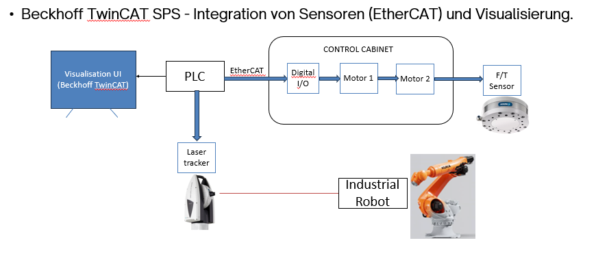

# 🏭 Beckhoff TwinCAT PLC — Sensor Integration (EtherCAT) + HMI Visualization

This repository documents one of my main automation tasks at Fraunhofer IPA: commissioning a PLC-controlled test setup using Beckhoff TwinCAT, integrating sensors via EtherCAT + Digital I/O, and building an HMI visualization to control experiments and monitor measurements.

> Note: Due to confidentiality policies at Fraunhofer IPA, source code, PLC project files, and internal configuration files cannot be shared in this repository.

---

## 🧩 System overview (block diagram)

Caption: Overall architecture of the PLC-controlled measurement setup (TwinCAT HMI ↔ PLC ↔ EtherCAT/Digital I/O ↔ motors/sensors, plus robot + metrology). 

---

## ✅ What was implemented

- PLC logic in Beckhoff TwinCAT using Structured Text (ST).
- Integration of sensor signals via EtherCAT and Digital I/O (reading, scaling, validation, and state handling).
- HMI / visualization (TwinCAT UI) acting as the central control interface for:
  - Starting/stopping experiments.
  - Enabling/disabling subsystems (motors/sensors).
  - Displaying live measurement values (e.g., force/torque and axis position/distance).
  - Operator guidance through a controlled experiment flow.

---

## 🤖 Measurement & validation workflow

- Executed measurement experiments on an industrial robot (KUKA-based setup).
- Validated robot motion using external metrology: a Leica laser tracker, connected to PLC via EtherCAT was used to measure the actual robot/tool motion.
- The test bench (linear axis) moved through defined trajectories, and the robot tool tip was commanded to move accordingly.
- A laser scanner mounted on the robot provided additional measurement/feedback, while the laser tracker served as the ground-truth reference.
- Collected sensor data (force/torque sensor, linear axis encoder, laser tracker) during robot motion and test sequences and made key values available in the PLC/HMI.
- Evaluated measured values and checked consistency against expected/calculated values to verify accuracy and reliability of the control and measurement chain.
- Used the visualization to run repeatable experiments and to monitor key signals during commissioning and testing.

---

## 📌 Repository contents
This repository is a documentation/portfolio-style summary (no source code included due to confidentiality).

- `Images/Block_Diagram.png` — System block diagram of the PLC, HMI, EtherCAT/Digital I/O, motors, sensors, and robot measurement setup. 
- `README.md` — Project description, responsibilities, and workflow summary. 

---

## 🛠️ How to use this repo
1. View the block diagram to understand the overall architecture and signal flow. 
2. Read the sections “What was implemented” and “Measurement & validation workflow” to understand the scope of my work (commissioning, integration, HMI, and experiments). 
