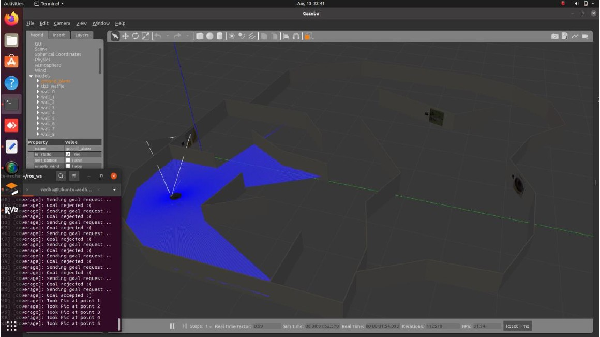
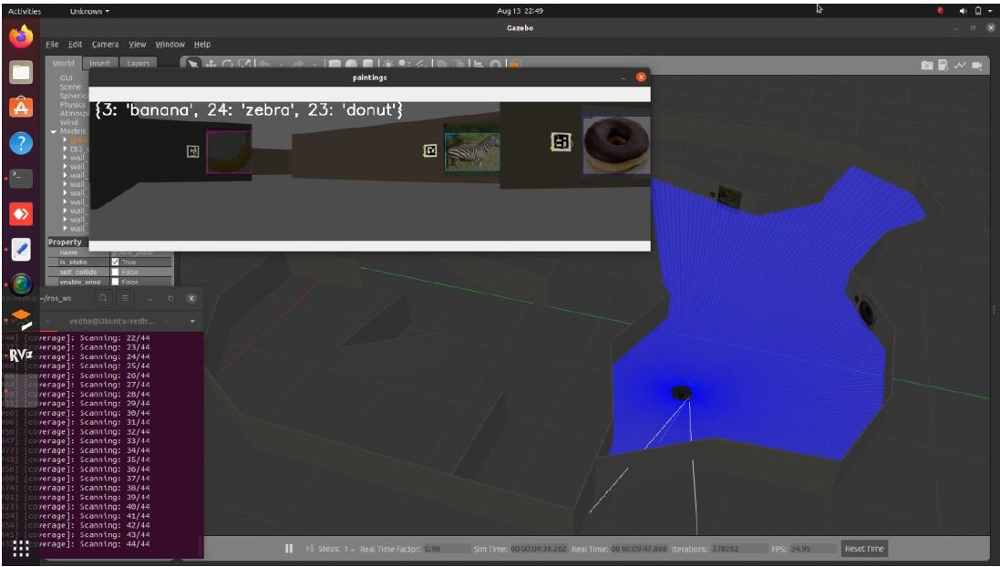

# 🎨🤖 Robot Art Gallery (ROS2) — TurtleBot Navigation + Artwork + AprilTag Detection

Course project for **ARAMS (Advanced Robotics and Autonomous Mobile Systems)** at **FH Aachen**.

This project runs a TurtleBot3 in a simulated art gallery, performs SLAM + waypoint navigation, captures wall images 📸, detects artworks 🖼️, and associates them with AprilTag IDs 🏷️.

---

## 🖼️ Screenshots

<p><b>Initialisation (SLAM / Nav2 bringup)</b></p>


<p><b>Navigation with image detection</b></p>


<p><b>Output at the end</b></p>


---


## 📁 Repository structure
- `my_robot_slam/` — ROS2 package (launch files for SLAM + execution)
- `Documentation/` — Project report (PDF) 📄
- `Project_video/` — Demo video(s) 🎥
- `README.md` — This file 🧾

---

## ✅ Requirements
- Ubuntu + ROS2 Foxy installed 🐧
- colcon build tools available 🧰
- Internet access to clone dependencies 🌐

---

## 🛠️ Setup (from scratch)

### 1) Install ROS / Ubuntu dependencies 📦
```bash
sudo apt update
sudo apt install ros-foxy-gazebo* ros-foxy-tf-transformations ros-foxy-nav2* -y
```
### 2) Install Python dependencies 🐍

```bash

sudo pip3 install transforms3d
pip3 install openvino opencv-python
```
### 3) Create workspace + clone repositories 📥

```bash

mkdir -p ~/ros_ws/src
cd ~/ros_ws/src

# AprilTag repository
git clone https://github.com/Tinker-Twins/AprilTag

# Art gallery repository (course environment)
git clone https://git.fh-aachen.de/mascor-public/arams/art_gallery -b 3at5

# Project repository (implementation)
git clone https://git.fh-aachen.de/vh5465s/arams_project_2022.git

```
### 4) Build 🔨
```bash
cd ~/ros_ws
colcon build --symlink-install

```
### ▶️ Run (3 terminals) 🖥️🖥️🖥️
Open three terminals and run the following:

### Terminal 1 — Start Gazebo simulation 🌍

```bash
cd ~/ros_ws
source install/setup.bash
ros2 launch tb3_gazebo arams.launch.py
```

### Terminal 2 — Start SLAM initialization 🗺️

```bash
cd ~/ros_ws
source install/setup.bash
ros2 launch my_robot_slam initiate.launch.py
```

### Terminal 3 — Start main execution (navigation + capture + detection) 🚶‍♂️📸🔍

```bash
cd ~/ros_ws
source install/setup.bash
ros2 launch my_robot_slam begin.launch.py
```

### 🧾 Output
- The robot navigates to defined waypoints 📍, faces walls 🧭, captures images 📸, and runs detection 🔎.

- The final output displays detected artworks 🖼️ together with associated AprilTag IDs 🏷️.

### ⚠️ Notes/ Known issues

- If real-time detection is heavy on the laptop 💻, it can be more stable to capture wall images first and run detection after.

- If the robot collides with a wall 💥, restart the simulation and rerun the launch sequence.

