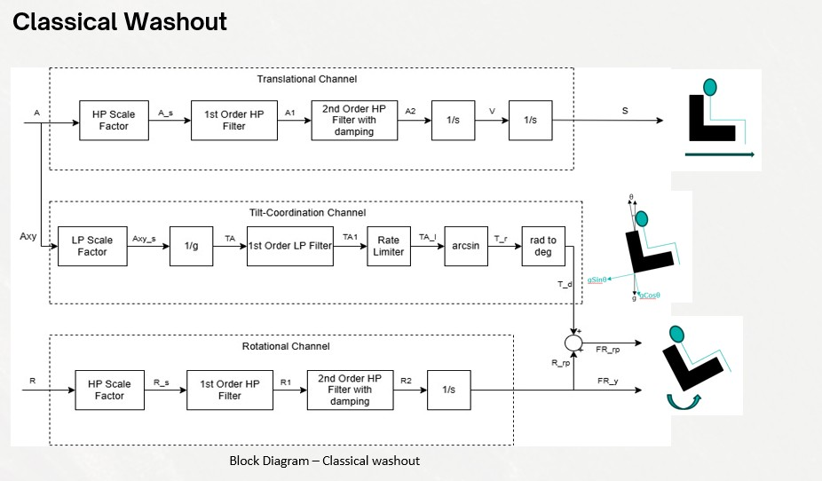
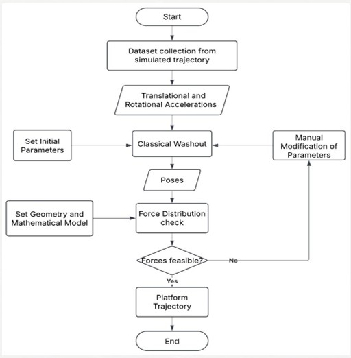
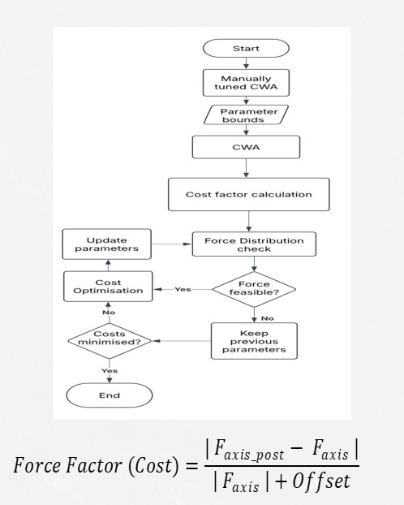
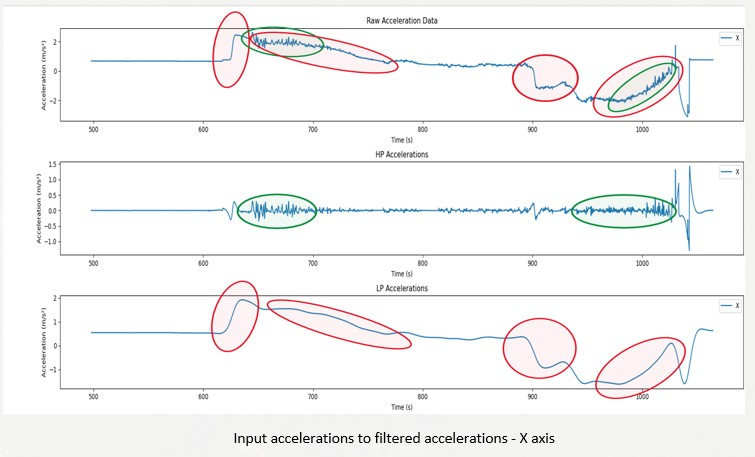
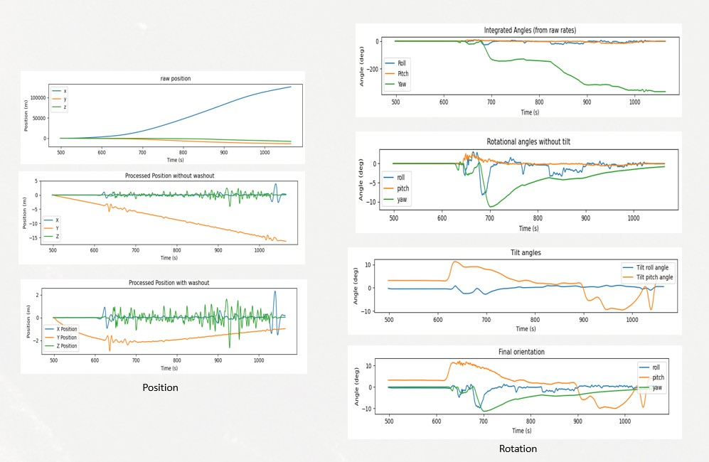
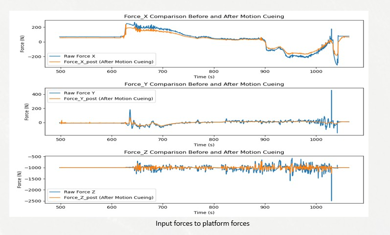
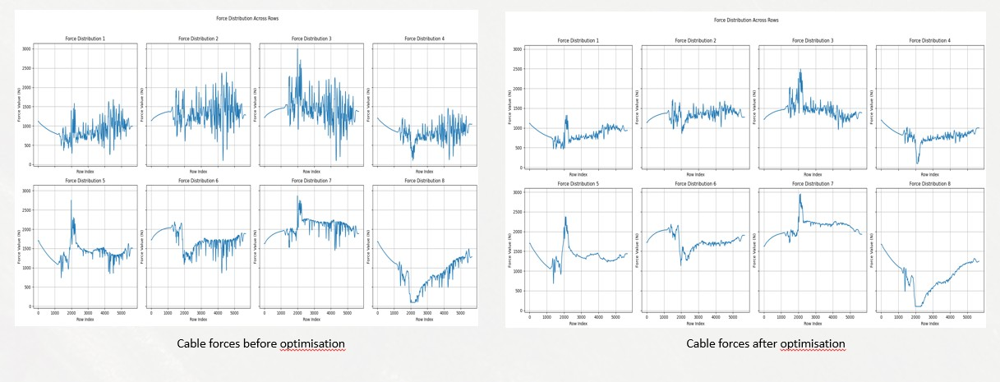

# Application of Motion-Cueing Algorithm on a Cable-Driven Parallel Robot (CDPR)

This repository contains the complete project files (code, report, and presentation) for the Master thesis **“Application of Motion-Cueing Algorithm on a Cable-Driven parallel robot”**.

The work focuses on implementing and evaluating a **Classical Washout Algorithm (CWA)** for motion cueing on a **Cable-Driven Parallel Robot (CDPR)**, with feasibility enforced using **cable force distribution constraints** (target platform: IPAnema 3 at Fraunhofer IPA, 8-cable CDPR).

---

## 🗂️ Repository structure

- `Codes/`  
  Python scripts and datasets used for data logging, motion cue generation (CWA), cable force feasibility validation, and cost-function based optimisation.

- `Report/`  
  Full thesis report (methodology, equations, results, evaluation).

- `Presentation/`  
  Final thesis presentation (high-level overview, pipeline, key plots and results).

---

## Project overview (what this thesis does)

###  1) Dataset generation (FlightGear)
A flight trajectory dataset is created using FlightGear by logging:
-  Translational accelerations (x, y, z)
-  Rotations / attitude (roll, pitch, yaw)

These signals are exported to CSV and used as the input to the motion cueing algorithm.

###  2) Classical Washout Algorithm (CWA) implementation
The Classical Washout Algorithm is implemented in Python following the typical 3-channel structure:
-  Translational channel (high-frequency cues via high-pass filtering + integration)
-  Rotational channel (high-frequency rotational cues via high-pass filtering + integration)
-  Tilt-coordination channel (low-frequency translational cues approximated using gravity-induced tilt)

Key parameters (scaling factors, washout damping, filter order, cut-off frequencies, sampling rate) can be tuned to control:
-  How aggressively motion is reproduced
-  How fast the platform “washes out” back to neutral
-  How the signal is separated into low/high frequency components

The algorithm output is a 6-DOF pose trajectory (motion cues), saved as CSV and visualized with plots.

###  3) Force feasibility using cable force distribution
Because CDPRs are constrained by cable tension limits, every generated pose is checked for feasibility using cable force distribution.
If a pose is not feasible (forces outside limits), it is flagged as invalid in the force distribution results.

###  4) Cost-function based optimisation (optional)
A force-based cost function is defined to compare:
- forces implied by the input trajectory  
vs.  
- forces implied by the motion-cued output trajectory

Optimisation is performed to tune selected washout parameters (primarily translational washout damping), while enforcing feasibility via cable force checks.

---

##  Diagrams (pipeline + algorithm)

###  Classical Washout (CWA) structure
This block diagram shows the 3-channel Classical Washout setup used in this thesis:
- Translational channel: high-frequency accelerations → platform translations
- Tilt-coordination channel: low-frequency components approximated via gravity tilt
- Rotational channel: high-frequency angular cues → platform rotations

  

---

###  Overall workflow (data → motion cues → feasibility)
High-level pipeline followed in this project:
- Log motion data from FlightGear and export CSV
- Generate motion cues using Classical Washout (6-DOF pose trajectory)
- Validate each pose using cable force distribution constraints
- Iterate parameters if poses are infeasible

  

---

### Cost function optimisation loop (optional step)
This flowchart shows the parameter optimisation loop:
- Start from manually tuned parameters and bounds
- Compute cost (force-factor style metric)
- Check force feasibility via force distribution
- Update parameters only if feasible and cost improves

### Force Factor (Cost) - term definitions

This cost metric measures how closely the motion-cued output reproduces the original (simulated) force profile along a given axis.

- **F_axis**: Raw/input force along the selected axis from the original trajectory (before applying the motion cueing algorithm).
- **F_axis_post**: Force along the same axis after applying the motion cueing algorithm (forces implied by the generated platform motion cues).
- **Offset**: Small constant added to improve numerical stability and reduce extreme ratios when the raw force is close to zero.

**Why add an Offset in the denominator?**
- **Avoid division by zero** when **F_axis** is close to 0.
- **Reduce outlier inflation** for very small forces, where even a small absolute difference could produce an unrealistically large ratio.

#### How to interpret it
- Lower value = better match between original forces and post-cueing forces.
- Higher value = larger deviation introduced by scaling, filtering, washout damping, and platform limits.

#### How it is used in this thesis
The Force Factor is computed per sample and per axis, then aggregated (typically using the mean over all samples of a trajectory) to produce a single cost value used for evaluating and optimising washout parameters, while ensuring cable-force feasibility.

  

---

##  Running the project (typical workflow)

1. Go to `Codes/Flight gear parameters/` 
   Generate / log FlightGear motion data to CSV.

2. Go to `Codes/MCA Classical Washout/`   
   Run the CWA implementation to generate motion cues (output CSV + plots).

3. Go to `Codes/Force distribution/`   
   Compute cable forces for the generated motion cues and validate feasibility.

4. (Optional) Use `Codes/Cost_factor/` and `Codes/FD_cost_factor/`   
   Evaluate force-factor metrics.

---

## Environment notes

- Some scripts require **WiPy3** and are intended to run on **Python 3.9.19**.
- Several scripts contain hardcoded paths and filenames from the original thesis setup.  
  If something fails, first check and update the input/output file paths inside the script.

---

##  Key results (high level)

-  A complete simulation pipeline was developed to generate **force-feasible** motion cues for a CDPR using a Classical Washout Algorithm.
-  The cost-function optimisation produced modest improvements in the cost metric in some cases, and improved overall force stability in cable force distribution plots.
-  The approach was additionally tested on different trajectories and payload conditions.

---

## Results (Graphical representation)

### 1) Effect of filtering (example: X-axis)
This figure illustrates how the Classical Washout filtering separates motion into components:
- High-frequency components are hightlighted by green and low frequency-components are highlighted by red.
- High-pass filtering preserves short, high-frequency acceleration events (onset cues).
- Low-pass filtering captures sustained low-frequency components that are later handled via tilt coordination.
Overall, this validates that the chosen cut-off frequencies provide a clean separation for motion cueing.

---

  

---

### 2) Platform pose generation (translation + rotation)
This figure shows the transformation from raw integrated signals (which drift and exceed limits) to controlled platform poses after applying washout:
- High-pass filtering reduces drift from direct integration.
- Washout damping drives the platform back toward neutral over time.
- Roll/pitch also include tilt-coordination components to represent sustained accelerations using gravity.

  

---

### 3) Platform forces (input vs after motion cueing)
This comparison shows how closely the motion-cued trajectory preserves the overall force trends of the original input:
- Deviations are expected due to scaling, filtering, and washout.
- The goal is to preserve perceptually important dynamics while keeping the platform feasible.

  

---

### 4) Cable force distribution (before vs after optimisation)
This figure compares force distribution across all 8 cables before and after parameter optimisation:
- After optimisation, cable forces are typically smoother and more stable (reduced fluctuations).
- This supports feasibility and improves load consistency across the cable robot during the trajectory.

  

---

##  Future work (from thesis outlook)

-  Hardware implementation on a real motion platform
-  Optimisation of rotational parameters (not only translational damping)
-  Axis-wise / decoupled optimisation strategies
-  Adaptive platform orientation / origin shifting for better workspace usage
-  Real-time optimisation and generalisation to other CDPR systems
