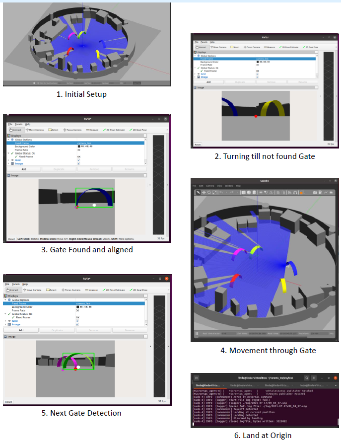

# 🛩️ Autonomous UAV Gate Navigation (ROS2 + Gazebo + OpenCV)

This project implements an autonomous UAV in Gazebo that takes off, searches for colour-coded gates, aligns to the gate, performs a loop manoeuvre while passing through, and finally returns to origin and lands.  
Gate detection is done using OpenCV (HSV filtering + contour detection + centering/alignment logic) based on the UAV camera stream.

---

## 🖼️ Simulation (screenshots)



---

## 🧠 Methodology (high level)

1. Start from HOME position.  
2. Take off and reach a target height.  
3. Start yaw search for the next gate.  
4. Detect gates in the sequence: **Blue → Green → Purple → Red → Yellow**.  
5. Draw a fixed-size rectangle around the gate contour and align using the bottom-left corner of the rectangle toward the screen center.  
6. Move towards the gate while maintaining alignment; when close enough, execute the loop manoeuvre and pass through.  
7. After passing, change yaw to face the next gate and repeat until all gates are completed.  
8. Return to origin and land.

---

## 👁️ Gate detection pipeline (OpenCV)

- Subscribe to the camera topic and convert to OpenCV image format with correct encoding.
- Blur the image, convert/filter in HSV, and create a colour mask for the current target gate.
- Find contours on the mask, build a bounding rectangle, and compute an alignment reference point (bottom-left corner).
- Use the reference point to generate yaw/position corrections until the gate is centered/aligned.
- Publish/stream the masked image with overlays for debugging.

---

## 📡 Obstacle awareness (LiDAR)

While navigating between gates, LiDAR/laser scan data is used to detect objects during motion (supporting safer navigation and debugging).

---

## 📁 Repository contents
- `p_arams/` — ROS2 package for the project.
- `Documentation_Aadithya_Sameer.pdf` — Project document.
- `Video_of_project_*.mp4` — Demonstration videos.
- `Images/` — Simulation screenshots used in this README.

---

## ▶️ Run the project

From your ROS2 workspace (build + source first):

### Option 1: Launch file
```bash
ros2 launch p_arams fly.launch.py
```
### Option 2: Run Node directly

```bash
ros2 run p_arams project_script
```

### 🚀 Future improvements

- Improve process flow and robustness of the state machine.
- Optimize and make motion commands more precise using position-based control.
- Reduce overall code length by refactoring (e.g., function reuse/overloading).

